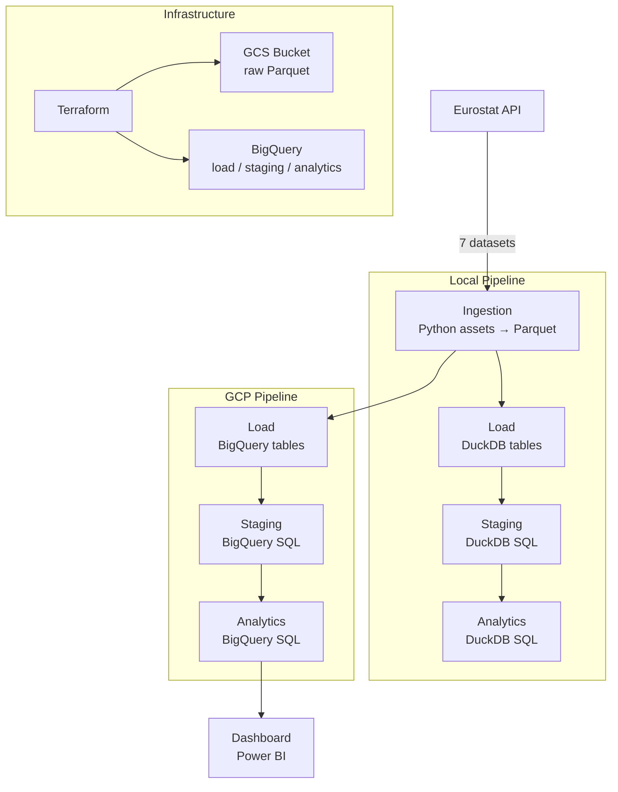
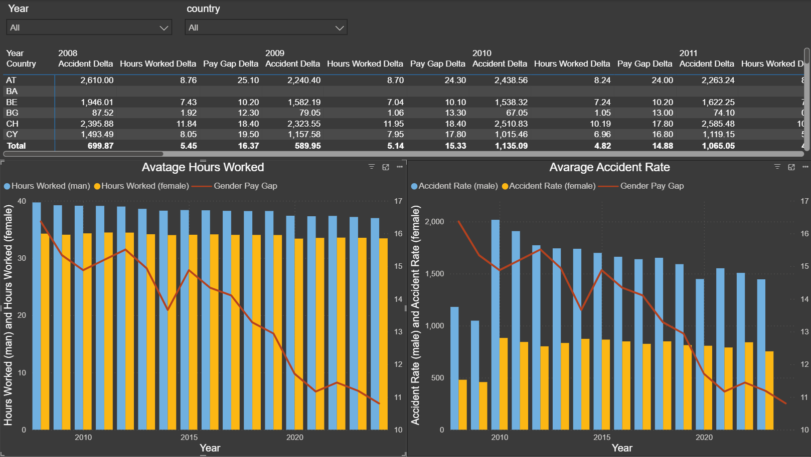
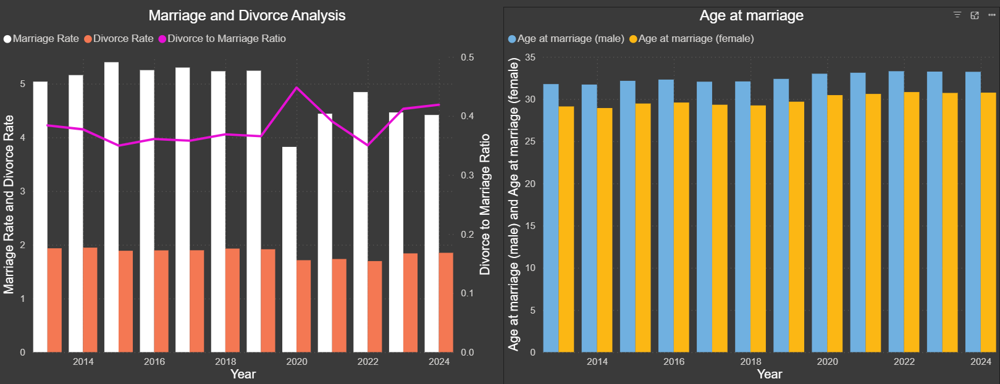

# Closer Every Year


A batch data pipeline tracking **gender gap indicators** and **relationship trends** (marriage, divorce, age at first marriage) across European countries from 2005 to 2024.

The data tells a story of convergence: the pay gap is narrowing, the age at first marriage is growing closer between men and women, employment rates are balancing. Numbers collected consistently over two decades, with no agenda — just direction.

Built as capstone project for the [DataTalksClub Data Engineering Zoomcamp 2026](https://github.com/DataTalksClub/data-engineering-zoomcamp).

---

## Table of Contents

- [Problem Statement](#problem-statement)
- [Key Findings](#key-findings)
- [Architecture](#architecture)
- [Tech Stack](#tech-stack)
- [Datasets](#datasets)
- [Pipeline Layers](#pipeline-layers)
- [Data Quality Checks](#data-quality-checks)
- [Zoomcamp Evaluation Criteria](#zoomcamp-evaluation-criteria)
- [How to Run](#how-to-run)
- [CI/CD](#cicd)
- [Project Structure](#project-structure)
- [Dashboard](#dashboard)
- [Bruin AI Data Analyst](#bruin-ai-data-analyst)
- [Notes](#notes)

---

## Problem Statement

Two questions drive this project:

**Relationships & Gender**
- Is the gender pay gap correlated with marriage and divorce trends across European countries?
- Is the gap between male and female age at first marriage narrowing over time?

**Gender Gap at Work**
- How do hours worked, accident rates, and employment levels differ between men and women?
- Are these labour market gaps moving in the same direction as the gender pay gap?

### Why These Datasets?

The choice of topic was intentional. Comparing men and women sits in territory that can feel controversial — but that's precisely the point. Data has a unique power: it removes judgment from the equation. There are no opinions here, no agenda. Just numbers collected consistently across European countries over two decades.

And what do those numbers tell us? That the story of gender difference is also, increasingly, a story of **convergence**. The gender pay gap is narrowing. The age at which men and women marry is growing closer. Employment rates between sexes are moving toward balance.

This project is also particularly relevant in 2026, with the EU Pay Transparency Directive (2023/970) entering enforcement — requiring companies across Europe to report and close gender pay gaps. The indicators tracked here are exactly those being monitored at a policy level by institutions like Eurostat and the European Institute for Gender Equality (EIGE).

The marriage and divorce data adds another layer. A slight decline in marriage rates might seem like a negative signal — but look closer: the average age at first marriage has been rising steadily for both men and women. People aren't avoiding marriage — they're approaching it more deliberately. This is especially true for women, whose age at first marriage has grown faster than men's, narrowing that gap too.

The goal was never to highlight division, but to measure progress. Because once you can measure something, you can understand it — and understanding is the first step forward.

---

## Key Findings

- 📉 **Gender pay gap declining**: across the EU, the gap has narrowed consistently from 2005 to 2024, with Northern European countries leading the trend
- 💍 **Age at first marriage converging**: the gap between male and female age at first marriage has shrunk in every tracked country — women are marrying later, men earlier
- ⚖️ **Employment gap halving**: female employment rates have grown faster than male rates in most EU countries, reducing the participation gap by roughly half since 2005
- 🏥 **Work accidents skewed male**: men account for the large majority of workplace accidents across all countries and years — a persistent and underreported gap
- 📊 **Divorce-to-marriage ratio stable**: despite a COVID-19 dip in marriages, the ratio returned to its long-term trend — the institution is evolving, not collapsing

---

## Architecture



Both pipelines share the **same asset code**. Local uses **DuckDB**, cloud uses **BigQuery**.
Bruin handles orchestration, dependency resolution, and materialization for both.

### Asset Dependency Graph (DAG)

```
[Eurostat API]
      │
      ▼
[ingestion] ──► Parquet → GCS
      │
      ▼
[load] ──► raw BigQuery tables (wide format)
      │
      ▼
[staging] ──► stg_relationships · stg_gender_gap  (cleaned, pivoted, merged)
      │
      ▼
[analytics] ──► analytics.relationships · analytics.gender_gap  (partitioned + clustered)
      │
      ▼
[Power BI Dashboard]
```

---

## Tech Stack

| Layer | Tool | Why |
|---|---|---|
| Orchestration + Transformation | [Bruin](https://getbruin.com) | Unified Python + SQL pipeline runner — replaces Airflow + dbt |
| Local Warehouse | DuckDB | Fast, zero-setup local development — same SQL as BigQuery |
| Cloud Warehouse | BigQuery (GCP) | Partitioned + clustered tables for analytics at scale |
| Data Lake | GCS (Google Cloud Storage) | Parquet staging before BigQuery load |
| Infrastructure as Code | Terraform | Reproducible GCP setup — bucket, datasets, all table schemas |
| Containerization | Docker + Docker Compose | Consistent environment for Bruin + Terraform |
| CI/CD | GitHub Actions | Scheduled pipeline runs + manual Terraform trigger |
| Dashboard | Power BI | Connected directly to BigQuery analytics tables |

---

## Datasets

All data sourced from the [Eurostat API](https://ec.europa.eu/eurostat) — the official statistical office of the European Union.

| Dataset | Eurostat Code | Key Columns |
|---|---|---|
| Crude marriage rate | `tps00206` | country, year, marriage_rate |
| Crude divorce rate | `tps00216` | country, year, divorce_rate |
| Mean age at first marriage | `tps00014` | country, year, age_at_marriage_f/m |
| Gender pay gap | `sdg_05_20` | country, year, gender_pay_gap |
| Hours worked (M/F) | `lfsa_ewhan2` | country, year, sex, hours_worked |
| Work accidents (M/F) | `hsw_n2_01` | country, year, sex, accidents |
| Employment rate (M/F) | `lfsa_eegan2` | country, year, sex, employed |

**Coverage:** 2005–2024 · 27+ EU countries · ~20 years of longitudinal data

---

## Pipeline Layers

### Ingestion
Python assets download raw data from the Eurostat API and save Parquet files to local disk or GCS. Each dataset is fetched independently, allowing partial retries without re-downloading everything.

### Load
Python assets read the Parquet files, unpivot from wide format (year columns) to long format using `pandas.melt()`, and write clean tables to DuckDB or BigQuery.

> **Why `pandas.melt()` instead of SQL UNPIVOT?** BigQuery does not support dynamic column pivoting in standard SQL — the column names (years) are not known at query-writing time. The wide→long transformation happens in Python before the data reaches SQL.

### Staging
SQL assets apply final transformations: M/F pivots, delta columns, null removal.
Uses `strategy: merge` on `(country, year)` — **idempotent by design**, no duplicates on re-run.

### Analytics

Two final tables, both **partitioned by `year_date`** and **clustered by `country`**:

**`analytics.relationships`** — marriage, divorce, age at marriage, gender pay gap

| Column | Description |
|---|---|
| `year_date` | DATE(year, 12, 31) — partition key |
| `country` | ISO 2-letter country code — cluster key |
| `year` | Year (integer) |
| `marriage_rate` | Marriages per 1,000 inhabitants |
| `divorce_rate` | Divorces per 1,000 inhabitants |
| `age_at_marriage_f` | Mean age at first marriage — women |
| `age_at_marriage_m` | Mean age at first marriage — men |
| `gender_pay_gap` | % pay gap (men earn X% more than women) |

**`analytics.gender_gap`** — labour market gender indicators

| Column | Description |
|---|---|
| `year_date` | DATE(year, 12, 31) — partition key |
| `country` | ISO 2-letter country code — cluster key |
| `year` | Year (integer) |
| `hours_worked_m` | Mean hours worked per week — men |
| `hours_worked_f` | Mean hours worked per week — women |
| `hours_worked_delta` | hours_worked_m − hours_worked_f |
| `gender_pay_gap` | % pay gap |
| `accidents_m` | Work accidents — men |
| `accidents_f` | Work accidents — women |
| `employed_m` | Employment rate — men |
| `employed_f` | Employment rate — women |

### Key Design Decisions

- **`pandas.melt()` instead of SQL UNPIVOT** — BigQuery does not support dynamic column pivoting; wide→long transformation happens in Python
- **Terraform as schema source of truth** — `strategy: merge` requires tables to exist before the first run; Terraform pre-creates all staging and analytics tables with explicit schemas in `terraform/tables.tf`
- **`type: table` for Python load assets** — avoids 409 conflict when multiple assets run in parallel with `strategy: merge`
- **`--workers 1` for local** — DuckDB does not support concurrent writes; the GCP pipeline runs with full parallelism

> Full rationale in [docs/strategy.md](docs/strategy.md).

---

## Data Quality Checks

Bruin runs quality checks **automatically after each asset materialises**. If any check fails, the pipeline halts and downstream assets do not execute — preventing bad data from reaching the dashboard.

| Asset | Checks |
|---|---|
| `stg_relationships` | `not_null` (country, year, marriage_rate, divorce_rate) · `unique` (country, year) |
| `stg_gender_gap` | `not_null` (country, year, sex, hours_worked) · `non_negative` (employed_m, employed_f, accidents_m, accidents_f) |
| `analytics.relationships` | `not_null + unique` (country, year_date) · `not_null` (gender_pay_gap, age_at_marriage_f, age_at_marriage_m) |
| `analytics.gender_gap` | `not_null + unique` (country, year_date) · `non_negative` (hours_worked_m, hours_worked_f) · `not_null` (hours_worked_delta) |

---

## Zoomcamp Evaluation Criteria

| Criterion | Implementation | Where |
|---|---|---|
| **Problem description** | 2 research questions across gender gap + relationship trends, 7 Eurostat datasets, 2005–2024 | README — Problem Statement |
| **Cloud** | GCP — BigQuery (warehouse) + GCS (data lake), fully cloud-native | `gcp-pipeline/` |
| **Infrastructure as Code** | Terraform provisions GCS bucket, BigQuery datasets, and all table schemas | `terraform/` |
| **Data ingestion (Batch)** | Bruin Python assets → Eurostat API → Parquet → GCS → BigQuery | `gcp-pipeline/assets/ingestion/` |
| **Data warehouse** | BigQuery tables partitioned by `year_date`, clustered by `country` | `gcp-pipeline/assets/analytics/` |
| **Transformations** | 4-layer pipeline: ingestion → load → staging → analytics, all via Bruin | `gcp-pipeline/assets/` |
| **Dashboard** | Power BI connected directly to BigQuery analytics tables | `docs/img/` |
| **Reproducibility** | Docker + docker-compose, `.env.example`, `.bruin.yml.example`, Terraform, GitHub Actions | Root + `terraform/` |
| **CI/CD** | GitHub Actions workflows: scheduled pipeline runs (1 Jan + 1 Jul) + manual Terraform trigger | `.github/workflows/` |

---

## How to Run

### Prerequisites

- Docker + Docker Compose installed and **running**
- A `.env` file — **required for both local and GCP**:

```bash
cp .env.example .env
```

For local development, `GOOGLE_CREDENTIALS`, `GCP_PROJECT_ID`, and `GCS_BUCKET` can be left empty.

- A `.bruin.yml` file:

```bash
cp .bruin.yml.example .bruin.yml
```

> Both pipelines run inside Docker containers — make sure Docker is running before any `docker compose` command.

---

### Local Pipeline (DuckDB — no cloud required)

**1. Start the container**
```bash
docker compose up -d
```

**2. Run the pipeline**
```bash
docker exec -it bruin-pipeline bruin run local-pipeline --workers 1
```
> `--workers 1` is required — DuckDB does not support concurrent writes.

**3. Query results**
```python
import duckdb

with duckdb.connect("data/duckdb.db") as conn:
    df = conn.execute("SELECT * FROM analytics.relationships LIMIT 10").df()
    print(df)
```

---

### GCP Pipeline (BigQuery)

**1. Fill in your `.env`** with GCP credentials (see `.env.example`).

**2. Start the containers**
```bash
docker compose up -d
```

**3. Create the Terraform state bucket** (one-time):
```bash
gcloud storage buckets create gs://tf-state-zoomcamp \
  --project=YOUR_PROJECT_ID \
  --location=EU
```

**4. Apply Terraform**
```bash
docker exec -it terraform sh
terraform init
terraform apply -auto-approve
exit
```

**5. Run the GCP pipeline**
```bash
docker exec -it bruin-pipeline bruin run --environment cloud gcp-pipeline
```

---

## CI/CD

Two GitHub Actions workflows handle automated runs:

### Pipeline (`pipeline.yml`)
Runs the full GCP pipeline automatically twice a year (Eurostat data updates on this cadence) and can be triggered manually from the Actions tab.

```
Scheduled: 1 January and 1 July at 08:00 UTC
Manual:    GitHub Actions → Run workflow
```

### Terraform (`terraform.yml`)
Manual-only trigger — used when infrastructure needs to be created or updated.

```
Manual: GitHub Actions → Run workflow
```

### Required Secrets and Variables

| Name | Type | Value |
|---|---|---|
| `GOOGLE_CREDENTIALS` | Secret | GCP service account JSON |
| `BRUIN_YML` | Secret | Full content of your `.bruin.yml` |
| `GCP_PROJECT_ID` | Variable | Your GCP project ID |
| `GCS_BUCKET` | Variable | Your GCS bucket path (e.g. `gs://my-bucket`) |
| `TF_VAR_bucket` | Variable | GCS bucket name without `gs://` prefix |
| `TF_VAR_region` | Variable | GCP region (e.g. `EU`) |
| `TF_VAR_billing_account_id` | Variable | GCP Billing Account ID (e.g. `XXXXXX-XXXXXX-XXXXXX`) — run `gcloud billing accounts list` |

---

## Project Structure

```
├── .github/
│   └── workflows/
│       ├── pipeline.yml       # Scheduled + manual GCP pipeline run
│       └── terraform.yml      # Manual Terraform apply
├── gcp-pipeline/
│   └── assets/
│       ├── ingestion/         # Python — Eurostat API → GCS Parquet
│       ├── load/              # Python — Parquet → BigQuery tables
│       ├── staging/           # SQL — clean, pivot, merge
│       └── analytics/         # SQL — final joined tables (partitioned + clustered)
├── local-pipeline/
│   └── assets/                # Same structure, DuckDB instead of BigQuery
├── terraform/
│   ├── main.tf                # Provider, GCS bucket, BQ datasets
│   ├── tables.tf              # All BigQuery table schemas (source of truth)
│   ├── variables.tf
│   └── output.tf
├── notebooks/                 # Exploratory data analysis (not part of production pipeline)
├── docs/
│   ├── img/                   # Dashboard screenshots
│   ├── strategy.md            # Pipeline design decisions and trade-offs
│   └── troubleshooting.md     # Common errors and fixes
├── Dockerfile.bruin           # Custom Bruin image with Python dependencies
├── docker-compose.yml         # Bruin + Terraform containers
├── .bruin.yml.example         # Bruin connection config template
└── .env.example               # Environment variables template
```

> **Note:** Files in `notebooks/` are for exploratory data analysis only and are not part of the production pipeline.

---

## Dashboard

Built with **Power BI**, connected directly to BigQuery (`analytics.relationships` and `analytics.gender_gap`).

### Gender Gap — Labour Market Indicators

[](docs/img/gender-gap.png)

*Hours worked delta, employment gap, work accident ratio, and gender pay gap trend across EU countries (2005–2024).*

### Marriage & Divorce Trends Across Europe

[](docs/img/marriage-divorce.png)

*Marriage rate, divorce rate, and age at first marriage by country and year, with M/F convergence highlighted.*

---

## Bruin AI Data Analyst

Analysis performed using the Bruin AI agent directly on the BigQuery analytics tables:

**Gender Pay Gap trend**
[](docs/img/bruin-ai-agent-gender-pay-gap.png)

**Marriage rate drop analysis**
[](docs/img/bruin-ai-agent-marriage-drop.png)

**Age at marriage gap between men and women**
[](docs/img/bruin-ai-agent-age-gap.png)

**Hours worked delta between men and women**
[](docs/img/bruin-ai-agent-hours-gap.png)

**Employment gap between men and women**
[](docs/img/bruin-ai-agent-employment-gap.png)

---

## Notes

- See [docs/strategy.md](docs/strategy.md) for pipeline design decisions and known issues
- See [docs/troubleshooting.md](docs/troubleshooting.md) for common errors and fixes
- Notebooks in `notebooks/` are for EDA only and are not part of the production pipeline
- The pipeline runs inside Docker — always ensure Docker Desktop is running before executing any command
